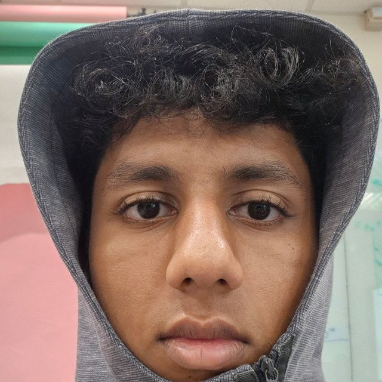
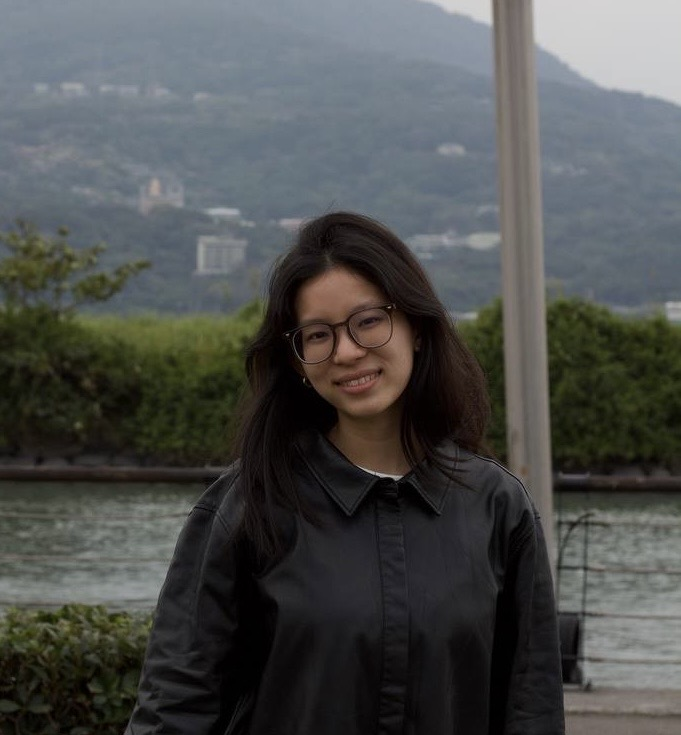

# About Us

We are a team based in the [School of Computing, National University of Singapore](https://www.comp.nus.edu.sg).

You can reach us at the email `seer[at]comp.nus.edu.sg`

## Project team

### Andrew Soon

[[homepage](https://andrewsoon.com)]
[[github](https://github.com/andrewsoonqn)]
[[portfolio](team/andrewsoon.md)]

### Sayyid Mehdi

[[homepage](https://www.linkedin.com/in/sayyid-mehdi-bin-safiyullah-a604171b4)]
[[github](https://github.com/lamemario)]
[[portfolio](team/sayyidmehdi.md)]

* Role: Project Developer

### Aishwarya Goyal

[[github](https://github.com/aishgogoyal)]
[[portfolio](team/aishgogoyal.md)]

* Role: Team Lead
* Responsibilities: UI

### Hazel Low

[[github](https://github.com/hqzell)]
[[portfolio](team/hqzell.md)]

* Role: Developer
* Responsibilities: Dev Ops + Threading

### Atharva

[[github](https://github.com/athrv2)]
[[portfolio](team/atharva.md)]

* Role: Developer
* Responsibilities: UI
