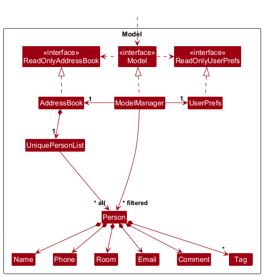
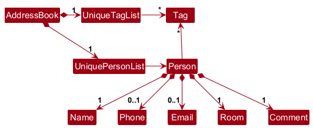

* Table of Contents
{:toc}

--------------------------------------------------------------------------------------------------------------------

## **Acknowledgements**

* The `comment` feature implementation is adapted from the se-edu tutorial [Adding optional fields to AB3](https://se-education.org/).

--------------------------------------------------------------------------------------------------------------------

## **Setting up, getting started**

Refer to the guide [_Setting up and getting started_](SettingUp.md).

--------------------------------------------------------------------------------------------------------------------

## **Design**

:bulb: **Tip:** The `.puml` files used to create diagrams are in this document `docs/diagrams` folder. Refer to the [_PlantUML Tutorial_ at se-edu/guides](https://se-education.org/guides/tutorials/plantUml.html) to learn how to create and edit diagrams.

### Architecture

The ***Architecture Diagram*** given above explains the high-level design of the App.

Given below is a quick overview of main components and how they interact with each other.

**Main components of the architecture**

**`Main`** (consisting of classes [`Main`](https://github.com/se-edu/addressbook-level3/tree/master/src/main/java/seedu/address/Main.java) and [`MainApp`](https://github.com/se-edu/addressbook-level3/tree/master/src/main/java/seedu/address/MainApp.java)) is in charge of the app launch and shut down.
* At app launch, it initializes the other components in the correct sequence, and connects them up with each other.
* At shut down, it shuts down the other components and invokes cleanup methods where necessary.

The bulk of the app's work is done by the following four components:

* [**`UI`**](#ui-component): The UI of the App.
* [**`Logic`**](#logic-component): The command executor.
* [**`Model`**](#model-component): Holds the data of the App in memory.
* [**`Storage`**](#storage-component): Reads data from, and writes data to, the hard disk.

[**`Commons`**](#common-classes) represents a collection of classes used by multiple other components.

**How the architecture components interact with each other**

The *Sequence Diagram* below shows how the components interact with each other for the scenario where the user issues the command `delete 1`.

Each of the four main components (also shown in the diagram above),

* defines its *API* in an `interface` with the same name as the Component.
* implements its functionality using a concrete `{Component Name}Manager` class (which follows the corresponding API `interface` mentioned in the previous point.

For example, the `Logic` component defines its API in the `Logic.java` interface and implements its functionality using the `LogicManager.java` class which follows the `Logic` interface. Other components interact with a given component through its interface rather than the concrete class (reason: to prevent outside component's being coupled to the implementation of a component), as illustrated in the (partial) class diagram below.

The sections below give more details of each component.

### UI component

The **API** of this component is specified in [`Ui.java`](https://github.com/se-edu/addressbook-level3/tree/master/src/main/java/seedu/address/ui/Ui.java)

The UI consists of a `MainWindow` that is made up of parts e.g.`CommandBox`, `ResultDisplay`, `PersonListPanel`, `StatusBarFooter` etc. All these, including the `MainWindow`, inherit from the abstract `UiPart` class which captures the commonalities between classes that represent parts of the visible GUI.

The `UI` component uses the JavaFx UI framework. The layout of these UI parts are defined in matching `.fxml` files that are in the `src/main/resources/view` folder. For example, the layout of the [`MainWindow`](https://github.com/se-edu/addressbook-level3/tree/master/src/main/java/seedu/address/ui/MainWindow.java) is specified in [`MainWindow.fxml`](https://github.com/se-edu/addressbook-level3/tree/master/src/main/resources/view/MainWindow.fxml)

The `UI` component,

* executes user commands using the `Logic` component.
* listens for changes to `Model` data so that the UI can be updated with the modified data.
* keeps a reference to the `Logic` component, because the `UI` relies on the `Logic` to execute commands.
* depends on some classes in the `Model` component, as it displays `Person` object residing in the `Model`.
* renders a resident's comment in `PersonCard` only when the comment is non-empty, so empty comments do not take up space in the list view.

### Logic component

**API** : [`Logic.java`](https://github.com/se-edu/addressbook-level3/tree/master/src/main/java/seedu/address/logic/Logic.java)

Here's a (partial) class diagram of the `Logic` component:

The sequence diagram below illustrates the interactions within the `Logic` component, taking `execute("delete 1")` API call as an example.

:information_source: **Note:** The lifeline for `DeleteCommandParser` should end at the destroy marker (X) but due to a limitation of PlantUML, the lifeline continues till the end of diagram.

How the `Logic` component works:

1. When `Logic` is called upon to execute a command, it is passed to an `AddressBookParser` object which in turn creates a parser that matches the command (e.g., `DeleteCommandParser`) and uses it to parse the command.
1. This results in a `Command` object (more precisely, an object of one of its subclasses e.g., `DeleteCommand`) which is executed by the `LogicManager`.
1. The command can communicate with the `Model` when it is executed (e.g. to delete a person). 
   Note that although this is shown as a single step in the diagram above (for simplicity), in the code it can take several interactions (between the command object and the `Model`) to achieve.
1. The result of the command execution is encapsulated as a `CommandResult` object which is returned back from `Logic`.

Here are the other classes in `Logic` (omitted from the class diagram above) that are used for parsing a user command:

How the parsing works:
* When called upon to parse a user command, the `AddressBookParser` class creates an `XYZCommandParser` (`XYZ` is a placeholder for the specific command name e.g., `AddCommandParser`) which uses the other classes shown above to parse the user command and create a `XYZCommand` object (e.g., `AddCommand`) which the `AddressBookParser` returns back as a `Command` object.
* All `XYZCommandParser` classes (e.g., `AddCommandParser`, `DeleteCommandParser`, ...) inherit from the `Parser` interface so that they can be treated similarly where possible e.g, during testing.

### Model component
**API** : [`Model.java`](https://github.com/se-edu/addressbook-level3/tree/master/src/main/java/seedu/address/model/Model.java)

The `Model` component,

* stores the address book data i.e., all `Person` objects (which are contained in a `UniquePersonList` object). Each `Person` stores immutable values for `Name`, `Phone`, `Email`, `Room`, `Comment`, and tags.
* stores the currently 'selected' `Person` objects (e.g., results of a search query) as a separate _filtered_ list which is exposed to outsiders as an unmodifiable `ObservableList<Person>` that can be 'observed' e.g. the UI can be bound to this list so that the UI automatically updates when the data in the list change.
* stores a `UserPref` object that represents the user’s preferences. This is exposed to the outside as a `ReadOnlyUserPref` objects.
* does not depend on any of the other three components (as the `Model` represents data entities of the domain, they should make sense on their own without depending on other components)

:information_source: **Note:** An alternative (arguably, a more OOP) model is given below. It has a `Tag` list in the `AddressBook`, which `Person` references. This allows `AddressBook` to only require one `Tag` object per unique tag, instead of each `Person` needing their own `Tag` objects. 

### Storage component

**API** : [`Storage.java`](https://github.com/se-edu/addressbook-level3/tree/master/src/main/java/seedu/address/storage/Storage.java)

The `Storage` component,
* can save both address book data and user preference data in JSON format, and read them back into corresponding objects.
* persists each person's comment in the JSON data file and loads missing `comment` fields as empty comments to preserve compatibility with older saved data.
* inherits from both `AddressBookStorage` and `UserPrefStorage`, which means it can be treated as either one (if only the functionality of only one is needed).
* depends on some classes in the `Model` component (because the `Storage` component's job is to save/retrieve objects that belong to the `Model`)

### Common classes

Classes used by multiple components are in the `seedu.address.commons` package.

--------------------------------------------------------------------------------------------------------------------

## **Implementation**

This section describes some noteworthy details on how certain features are implemented.

### \[Proposed\] Undo/redo feature

#### Proposed Implementation

The proposed undo/redo mechanism is facilitated by `VersionedAddressBook`. It extends `AddressBook` with an undo/redo history, stored internally as an `addressBookStateList` and `currentStatePointer`. Additionally, it implements the following operations:

* `VersionedAddressBook#commit()` — Saves the current address book state in its history.
* `VersionedAddressBook#undo()` — Restores the previous address book state from its history.
* `VersionedAddressBook#redo()` — Restores a previously undone address book state from its history.

These operations are exposed in the `Model` interface as `Model#commitAddressBook()`, `Model#undoAddressBook()` and `Model#redoAddressBook()` respectively.

Given below is an example usage scenario and how the undo/redo mechanism behaves at each step.

Step 1. The user launches the application for the first time. The `VersionedAddressBook` will be initialized with the initial address book state, and the `currentStatePointer` pointing to that single address book state.

Step 2. The user executes `delete 5` command to delete the 5th person in the address book. The `delete` command calls `Model#commitAddressBook()`, causing the modified state of the address book after the `delete 5` command executes to be saved in the `addressBookStateList`, and the `currentStatePointer` is shifted to the newly inserted address book state.

Step 3. The user executes `add n/David …​` to add a new person. The `add` command also calls `Model#commitAddressBook()`, causing another modified address book state to be saved into the `addressBookStateList`.

:information_source: **Note:** If a command fails its execution, it will not call `Model#commitAddressBook()`, so the address book state will not be saved into the `addressBookStateList`.

Step 4. The user now decides that adding the person was a mistake, and decides to undo that action by executing the `undo` command. The `undo` command will call `Model#undoAddressBook()`, which will shift the `currentStatePointer` once to the left, pointing it to the previous address book state, and restores the address book to that state.

:information_source: **Note:** If the `currentStatePointer` is at index 0, pointing to the initial AddressBook state, then there are no previous AddressBook states to restore. The `undo` command uses `Model#canUndoAddressBook()` to check if this is the case. If so, it will return an error to the user rather
than attempting to perform the undo.

The following sequence diagram shows how an undo operation goes through the `Logic` component:

:information_source: **Note:** The lifeline for `UndoCommand` should end at the destroy marker (X) but due to a limitation of PlantUML, the lifeline reaches the end of diagram.

Similarly, how an undo operation goes through the `Model` component is shown below:

The `redo` command does the opposite — it calls `Model#redoAddressBook()`, which shifts the `currentStatePointer` once to the right, pointing to the previously undone state, and restores the address book to that state.

:information_source: **Note:** If the `currentStatePointer` is at index `addressBookStateList.size() - 1`, pointing to the latest address book state, then there are no undone AddressBook states to restore. The `redo` command uses `Model#canRedoAddressBook()` to check if this is the case. If so, it will return an error to the user rather than attempting to perform the redo.

Step 5. The user then decides to execute the command `list`. Commands that do not modify the address book, such as `list`, will usually not call `Model#commitAddressBook()`, `Model#undoAddressBook()` or `Model#redoAddressBook()`. Thus, the `addressBookStateList` remains unchanged.

Step 6. The user executes `clear`, which calls `Model#commitAddressBook()`. Since the `currentStatePointer` is not pointing at the end of the `addressBookStateList`, all address book states after the `currentStatePointer` will be purged. Reason: It no longer makes sense to redo the `add n/David …​` command. This is the behavior that most modern desktop applications follow.

The following activity diagram summarizes what happens when a user executes a new command:

#### Design considerations:

**Aspect: How undo & redo executes:**

* **Alternative 1 (current choice):** Saves the entire address book.
  * Pros: Easy to implement.
  * Cons: May have performance issues in terms of memory usage.

* **Alternative 2:** Individual command knows how to undo/redo by
  itself.
  * Pros: Will use less memory (e.g. for `delete`, just save the person being deleted).
  * Cons: We must ensure that the implementation of each individual command are correct.

_{more aspects and alternatives to be added}_

### Sorting Feature

#### Implementation

The sorting feature is integrated into the `list` command. It allows users to view all residents ordered by a chosen field (name, room, phone, or email).

The implementation relies on JavaFX's `SortedList`, which is initialized in `ModelManager` to wrap around the `filteredPersons` list. This architectural choice ensures that whenever the filter changes (e.g., via `find`), the sort order can still be applied to the filtered subset.

1.  `ListCommandParser` identifies the `-sort` option and maps the following field prefix (`n/`, `r/`, `p/`, `e/`) to a corresponding `Comparator<Person>`.
2.  `ListCommand` is created with the field name and its comparator.
3.  Upon execution, `ListCommand` calls `Model#updateFilteredPersonList(Predicate, Comparator)`.
4.  `ModelManager` sets the filter on its `FilteredList` and the comparator on its `SortedList`.
5.  If a simple `list` (without parameters) or a filtering command (like `find`) is used, the sort comparator is reset to `null`.

#### Design considerations

**Aspect: How sorting interacts with filtering**

*   **Choice (current):** Sort order is reset when a new filter is applied unless specified via `list -sort <prefix>/`.
    *   Pros: Predictable behavior; users always see the list state they explicitly requested.
    *   Cons: Users cannot "keep" a sort order while performing multiple different searches without re-specifying the sort field.

--------------------------------------------------------------------------------------------------------------------

## **Documentation, logging, testing, configuration, dev-ops**

* [Documentation guide](Documentation.md)
* [Testing guide](Testing.md)
* [Logging guide](Logging.md)
* [Configuration guide](Configuration.md)
* [DevOps guide](DevOps.md)

--------------------------------------------------------------------------------------------------------------------

## **Appendix: Requirements**

### Product scope

**Target user profile**:

Felix is a Year 3 Soc student and RA at Acacia College. Approachable and proactive, he enjoys connecting with residents and planning events for them regularly. He loves his terminal. However, he has poor memory and gets overwhelmed during orientation, because of the messy process of onboarding residents and collecting data.

**Value proposition**: RACE provides a single, dedicated system to manage resident details safely, keeping sensitive information private. During orientation, RAs must onboard 40+ residents quickly, and RACE helps to manage resident information efficiently, instead of current scattered and slow workflows.

### User stories

* As a new RA, I can add a resident with the required details, so that I can register residents quickly during onboarding.
* As an RA handling a busy intake, I can include optional fields in the same `add` command, so that incomplete information does not block onboarding.
* As an RA, I can list all residents, so that I can review the current roster at a glance.
* As a forgetful RA, I can find residents by name keyword or exact room, so that I can retrieve a record even when I only remember partial information.
* As an RA, I can edit a resident's core details, so that the address book stays accurate when contact information changes.
* As an RA, I can add or clear a private comment for a resident, so that I can keep follow-up notes without changing the resident's main details.
* As an RA, I can delete resident records that are no longer needed, so that the address book remains organised.
* As a new RA, I can refer to help and documentation, so that I can learn the command format quickly.

### Use cases

(For all use cases below, the **System** is the `AddressBook` and the **Actor** is the `user`, unless specified otherwise)

**Use case: Delete a person**

**MSS**

1.  User requests to list persons
2.  AddressBook shows a list of persons
3.  User requests to delete a specific person in the list
4.  AddressBook deletes the person

    Use case ends.

**Extensions**

* 2a. The list is empty.

  Use case ends.

* 3a. The given index is invalid.

    * 3a1. AddressBook shows an error message.

      Use case resumes at step 2.

**Use case: Add or clear a resident comment**

**MSS**

1. User requests to list residents or find a resident.
2. System shows a list of residents with their indices.
3. User requests to add a comment to a specific resident in the list.
4. System updates the resident's comment.
5. System shows the updated resident list.

   Use case ends.

**Extensions**

* 2a. The list is empty.

  Use case ends.

* 3a. The given index is invalid.

    * 3a1. System shows an error message.

      Use case resumes at step 2.

* 3b. The user provides `c/` with no text.

    * 3b1. System clears the resident's existing comment.

      Use case ends.

**Use case: Batch Onboarding**

**MSS**

1. User requests to list all residents to check current occupancy.
2. System shows a list of residents.
3. User requests to add a new resident with mandatory and optional fields.
4. System validates the data and adds the resident to the database.
5. User requests to add another new resident with mandatory and optional fields.
6. System adds the second resident.
7. User verifies the new list.

   Use case ends.

**Extensions**

* 3a. The room number is already assigned to another resident.
    * 3a1. System shows an error message.
    * Use case resumes at step 3.
* 3b. User input is invalid.
    * 3b1. System shows an error message regarding the format.
    * Use case resumes at step 3.

**Use case: Search for Resident During Emergency**

**MSS**

1. User requests to find a resident using a partial name keyword or an exact room number.
2. System shows a filtered list of matching residents with their indices.
3. User identifies the correct resident and room number from the results.
4. User requests to update the resident's phone number to the latest provided.
5. System updates the record and confirms the change.

   Use case ends.

**Extensions**

* 1a. No residents match the keyword.
    * 1a1. System shows "No residents found matching [keyword]."
    * Use case ends.
* 1b. The search keyword is too broad (e.g., >200 matches).
    * 1b1. User refines search.
    * Use case resumes at step 1.

**Use case: Mid-Semester Room Swap**

**MSS**

1. User requests to find the two residents involved in the swap.
2. System shows the current records for both residents.
3. User requests to update Resident A to a temporary placeholder room.
4. User requests to update Resident B to Resident A’s original room.
5. User requests to update Resident A to Resident B’s original room.
6. System confirms all updates are successful.

   Use case ends.

**Extensions**

* 3a. The user attempts to move a resident into an occupied room without using a placeholder.
    * 3a1. System shows a duplicate room error.
    * Use case resumes at step 3.

**Use case: Bulk Removal of Graduating Residents**

**MSS**

1. User requests to list all residents.
2. System shows the full list.
3. User requests to delete multiple residents by providing a list of indices.
4. System asks for confirmation for the bulk deletion.
5. User confirms the deletion.
6. System removes all specified records.

   Use case ends.

**Extensions**

* 3a. One or more provided indices are out of range.
    * 3a1. System shows an error message identifying the invalid index.
    * Use case resumes at step 2.
* 5a. User cancels the confirmation.
    * 5a1. System aborts the deletion; data remains unchanged.
    * Use case ends.

**Use case: Managing Medical/Special Needs**

**MSS**

1. User requests to find residents with a specific tag (e.g., "asthma").
2. System shows a list of residents matching the tag.
3. User requests to view the full details of a specific resident.
4. User requests to append a specific dietary note to that resident’s record.
5. System preserves the history and appends the new note.

   Use case ends.

**Extensions**

* 1a. No residents are found with that tag.
    * 1a1. System shows an empty list or "No residents found."
    * Use case ends.
* 4a. The user provides an invalid index for the update.
    * 4a1. System shows an error message.
    * Use case resumes at step 2.

### Non-Functional Requirements

1.  Should work on any _mainstream OS_ as long as it has Java `17` or above installed.
2.  Should be able to hold up to 1000 persons without a noticeable sluggishness in performance for typical usage.
3.  A user with above average typing speed for regular English text (i.e. not code, not system admin commands) should be able to accomplish most of the tasks faster using commands than using the mouse.
4. Should respond to most user commands within 2 seconds for typical usage involving up to 40 resident records.
5. Should store all resident information locally on the user’s device and should not require an internet connection to perform any core features.
6. Should provide clear and informative error messages when the user enters an invalid command or incorrect parameters.
7. Should preserve all stored resident data between application restarts, unless the user explicitly deletes the data.
8. Should allow users to recover the application state from saved data files without manual editing of the data files.
9. Should keep command output readable within a standard terminal window width (e.g., ~120 characters).

### Glossary

* **Mainstream OS**: Windows, Linux, Unix, MacOS
* **Private contact detail**: A contact detail that is not meant to be shared with others
* **Resident**: A person living in the residential college whose information is stored and managed by the system. Each resident record may include fields such as name, room number, and other optional details.
* **Resident Assistant (RA)**: The primary user of the application who manages resident information, performs onboarding, and maintains records throughout the semester for a batch of residents living in the residential college.
* **Comment**: A free-form note stored with a resident record for short contextual information such as follow-ups or special reminders.
* **User's Preferences (UserPref)**: Settings related to the application environment (e.g., window size or file paths) that are saved locally and loaded when the application starts.
* **JSON**: JSON (JavaScript Object Notation) is the data format used by the application to store resident information and user preferences on disk.
* **Index**: The number used by commands (e.g., `delete 1`) to identify a resident from the currently displayed list.
* **GUI (Graphical User Interface)**: The visual interface of the application, built using JavaFX, which allows users to interact with the system through visual components.

--------------------------------------------------------------------------------------------------------------------

## **Appendix: Instructions for manual testing**

Given below are instructions to test the app manually.

:information_source: **Note:** These instructions only provide a starting point for testers to work on;
testers are expected to do more *exploratory* testing.

### Launch and shutdown

1. Initial launch

   1. Download the jar file and copy into an empty folder

   1. Double-click the jar file Expected: Shows the GUI with a set of sample contacts. The window size may not be optimum.

1. Saving window preferences

   1. Resize the window to an optimum size. Move the window to a different location. Close the window.

   1. Re-launch the app by double-clicking the jar file. 
       Expected: The most recent window size and location is retained.

1. _{ more test cases …​ }_

### Sorting residents

1. Sorting residents by different fields

   1. Prerequisites: Multiple residents with different names, rooms, and phone numbers.
   
   1. Test case: `list -sort r/` 
      Expected: List is updated to show all residents sorted by room number (format: #BLOCK-ROOM-LETTER). Status message confirms sorting.

   1. Test case: `list -sort p/` 
      Expected: List is updated to show all residents sorted by their phone numbers.

   1. Test case: `list -sort x/` 
      Expected: No sorting occurs. Error message "Invalid sort field! Supported field prefixes: n/, r/, p/, e/" is displayed.

### Deleting a person

1. Deleting a person while all persons are being shown

   1. Prerequisites: List all persons using the `list` command. Multiple persons in the list.

   1. Test case: `delete 1` 
      Expected: First contact is deleted from the list. Details of the deleted contact shown in the status message. Timestamp in the status bar is updated.

   1. Test case: `delete 0` 
      Expected: No person is deleted. Error details shown in the status message. Status bar remains the same.

   1. Other incorrect delete commands to try: `delete`, `delete x`, `...` (where x is larger than the list size) 
      Expected: Similar to previous.

1. _{ more test cases …​ }_

### Editing a person's comment

1. Adding or clearing a comment while all persons are being shown

   1. Prerequisites: List all persons using the `list` command. Multiple persons in the list.

   1. Test case: `comment 1 c/Requires wheelchair-accessible venue` 
      Expected: The first person's comment is updated. The success message is shown in the result display. The person card shows the new comment.

   1. Test case: `comment 1 c/` 
      Expected: The first person's comment is removed. The success message is shown in the result display. The comment label is no longer shown on the person card.

   1. Other incorrect comment commands to try: `comment`, `comment 1`, `comment 0 c/test`, `comment x c/test`, `comment 1 c/first c/second` 
      Expected: No person's comment is changed. Error details are shown in the result display.

### Saving data

1. Dealing with missing/corrupted data files

   1. _{explain how to simulate a missing/corrupted file, and the expected behavior}_

1. _{ more test cases …​ }_
